## 📱 Actividad Integradora 2 - Tienda Virtual

### Descripción breve
Aplicación de tienda virtual que permite iniciar sesión con usuarios predefinidos (cargados desde JSON), visualizar un catálogo de productos (desde JSON), agregar productos al carrito con cantidades, y gestionar órdenes de compra (crear, modificar estado y eliminar) almacenadas en memoria.

### ¿Continuación o nueva app?
Es una **nueva aplicación** desarrollada desde cero para esta actividad.

### Nuevas funcionalidades implementadas
- Login con autenticación local (JSON).
- Catálogo de productos con GridView.
- Carrito de compras con modificación de cantidades (setState).
- Creación de órdenes a partir del carrito.
- Listado de órdenes del usuario.
- Edición del estado de una orden (pendiente/completada/cancelada).
- Eliminación de órdenes con confirmación.
- Persistencia de sesión con SharedPreferences.
- Preparación de la arquitectura para conectar a una API (servicios separados).

### Pantallas desarrolladas
1. **LoginScreen**: autenticación de usuarios con validación contra JSON.
2. **HomeScreen**: catálogo de productos en GridView, botón para agregar al carrito.
3. **CartScreen**: lista de productos agregados, ajuste de cantidades, cálculo de total y confirmación de compra.
4. **OrdersScreen**: historial de órdenes del usuario, con opciones de modificar (estado) y eliminar.

### Widgets nuevos utilizados
- `GridView` (home)
- `ListView` (carrito y órdenes)
- `Card` (productos y órdenes)
- `CircleAvatar` (foto de perfil)
- `ElevatedButton`
- `FloatingActionButton` (acceso rápido al carrito)
- `IconButton`
- `Container`, `Padding`, `SizedBox`, `Expanded`, `Divider`

### Interacciones implementadas
- Navegación entre todas las pantallas mediante `Navigator.pushNamed`.
- `SnackBar` al agregar productos al carrito y al confirmar compra.
- `AlertDialog` para confirmar eliminación de órdenes.
- `AlertDialog` para modificar estado de orden con DropdownButton.
- Cambio dinámico de cantidades en el carrito.

### Funcionalidad con `setState`
Se utiliza `setState` en:
- **CartScreen**: para incrementar/decrementar cantidades, actualizar el total y eliminar productos del carrito.
- **OrdersScreen**: para recargar la lista de órdenes después de crear, modificar o eliminar.

### Paquete externo utilizado
- **shared_preferences**: se usa para guardar el email del usuario logueado y mantener la sesión entre reinicios de la app (auto-login).

### Personalización realizada
- **Nombre de la app**: "Mi Tienda Virtual" (modificado en `AndroidManifest.xml` y en `MaterialApp`).
- **Ícono**: se generó el ícono utilizando icon.kitchen y se reemplazaron manualmente los archivos en las carpetas res de Android (mipmap-hdpi, mipmap-mdpi, mipmap-xhdpi, mipmap-xxhdpi, mipmap-xxxhdpi)
- **Logotipo**: mostrado en la pantalla de login.
- **Colores**: azul marino (`#0A2647`) como primario y dorado (`#D4AF37`) como secundario.

### Capturas de pantalla
- **Vista principal de bienvenida y acceso a la interfaz de usuario**

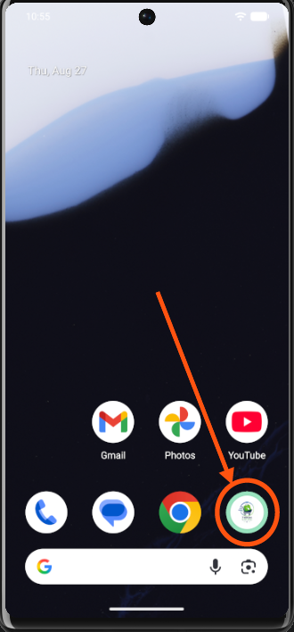

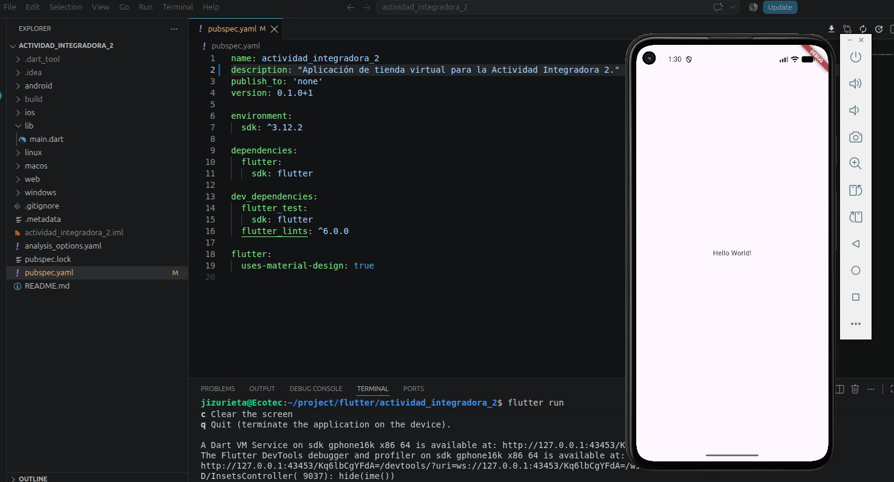

- **Implementación del módulo de autenticación y validación de credenciales con datos locales en formato JSON**

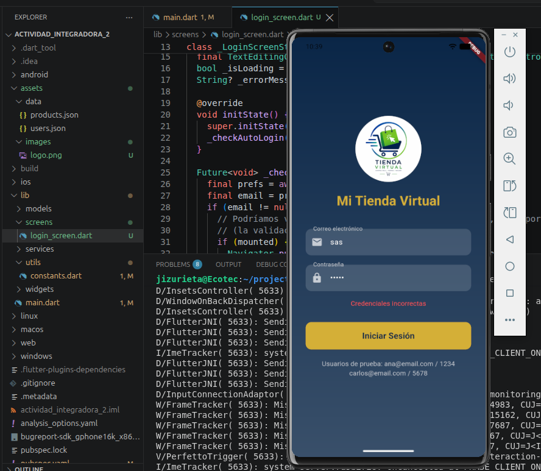

- **C Desarrollo de la vista de inicio donde se listan los artículos disponibles para la compra**

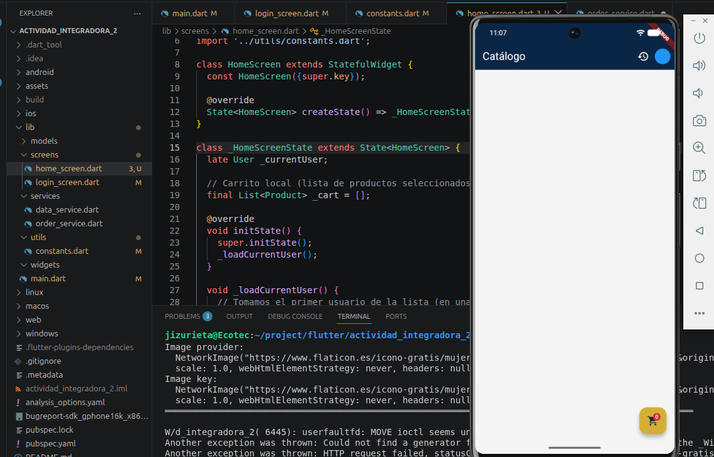

- **Carga asíncrona de los datos del catálogo consumiendo el recurso JSON interno**

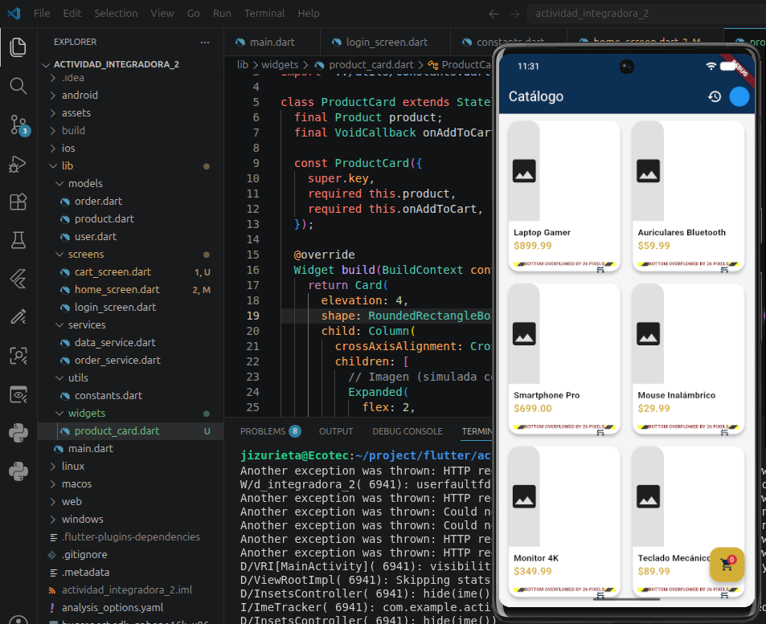

- **Implementación de la lógica "Agregar al carrito" para añadir artículos seleccionados**

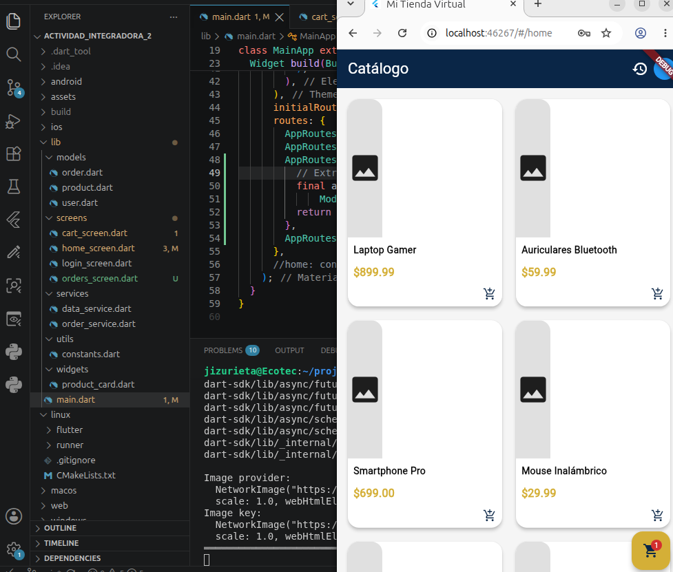

- **Visualización detallada del carrito de compras, mostrando los artículos añadidos y sus cantidades**

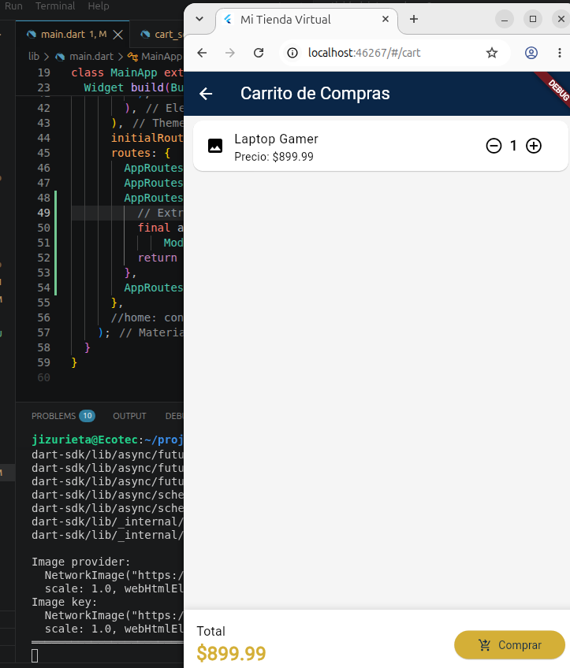

- **Confirmación inicial del pedido; la orden de compra se registra automáticamente con estado "Pendiente"**

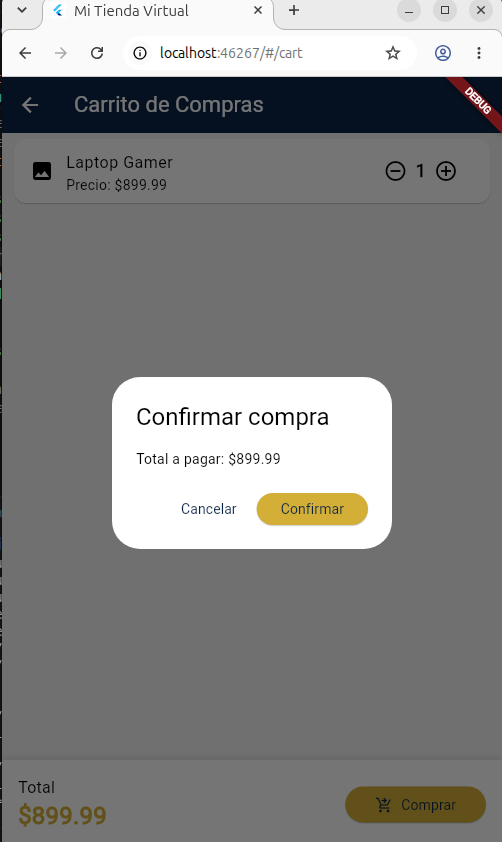

- **Flujo de administración para confirmar o rechazar la orden de compra generada**

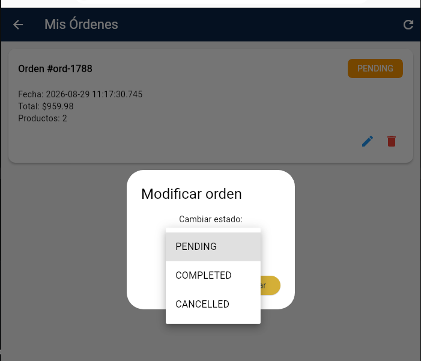

- **Confirmación exitosa del pedido. La orden actualiza su estado a "Confirmada"**

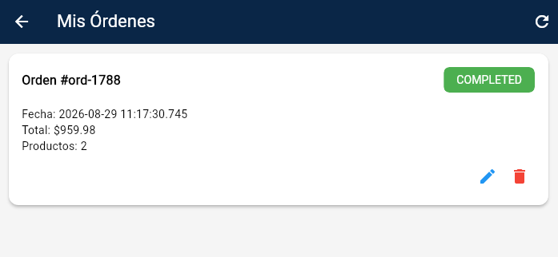

### Unidad integradora 3 campos adicionales

- **Estructura del proyecto**

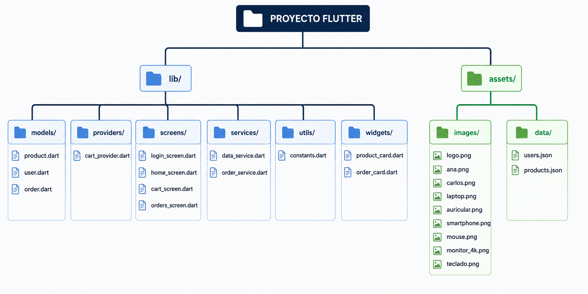

- **Agregar dependencia del provider**

 dependencies:

    flutter:
        sdk: flutter
    provider: ^6.0.0
    shared_preferences: ^2.2.0

### Instrucciones para ejecutar
1. Clonar el repositorio.
2. Ejecutar `flutter pub get` para instalar dependencias.
3. Conectar un emulador Android o dispositivo físico.
4. Ejecutar `flutter run`.
5. Usar las credenciales de prueba:
   - `ana@email.com` / `1234`
   - `carlos@email.com` / `5678`

## Autor
**JAIME DAVID IZURIETA ROSERO**